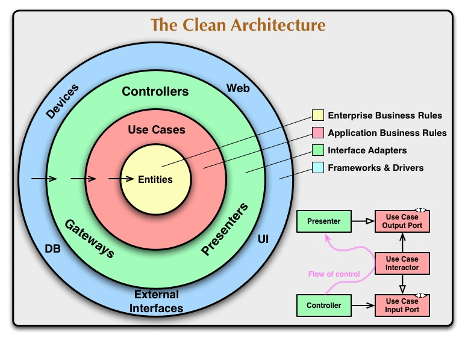
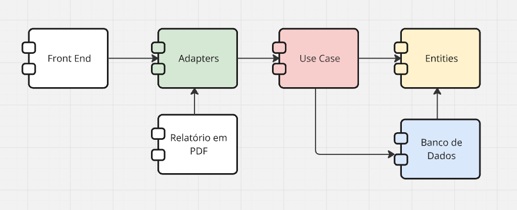
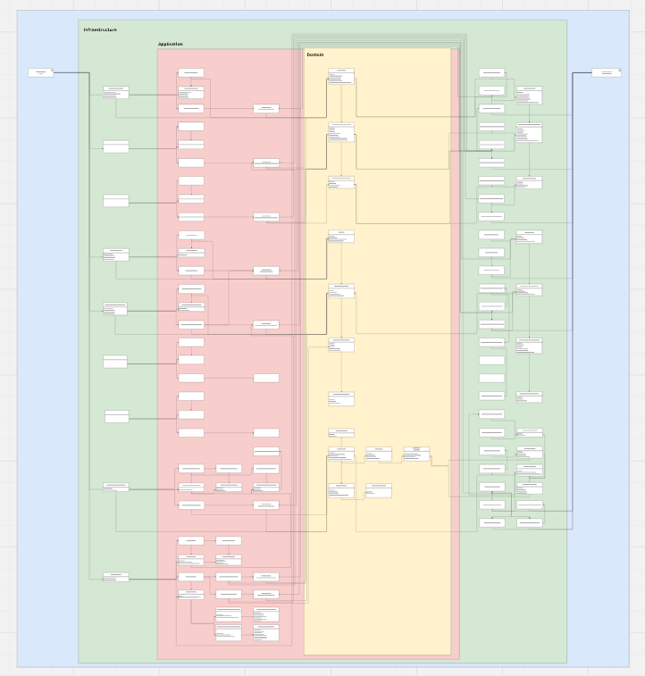

# Boletim Saúde


## 📋 Índice (documentação em construção)

- [Boletim Saúde](#boletim-saúde)
  - [📋 Índice (documentação em construção)](#-índice-documentação-em-construção)
  - [💻 Sobre o Projeto](#-sobre-o-projeto)
  - [⚙️ Funcionalidades](#️-funcionalidades)
    - [Boletim Diário](#boletim-diário)
    - [Relatórios Mensais](#relatórios-mensais)
    - [Edição do Boletim](#edição-do-boletim)
    - [Gerenciamento de Especialidades](#gerenciamento-de-especialidades)
    - [Gerenciamento de Cirurgiões](#gerenciamento-de-cirurgiões)
  - [🛠 Tecnologias](#-tecnologias)
    - [Infraestrutura](#infraestrutura)
    - [Backend](#backend)
    - [Frontend](#frontend)
  - [🏗 Arquitetura](#-arquitetura)
    - [API](#api)
  - [🏗 Design](#-design)
  - [🚀 Como Executar o Projeto](#-como-executar-o-projeto)
    - [Docker](#docker)
  - [🧪 Testando o Projeto](#-testando-o-projeto)
  - [🦸 Autor](#-autor)
    - [Lucas Leme](#lucas-leme)

## 💻 Sobre o Projeto

Projeto desenvolvido para a Prefeitura Municipal de Itaberá, com o objetivo de facilitar a criação de relátorios diários e mensais dos atendimentos medicos realizados do município.


## ⚙️ Funcionalidades

### Boletim Diário

- Criação de boletim
- Download do boletim
- Busca de boletins anteriores


### Relatórios Mensais

- Geração de relatórios
- Download de reatórios


### Edição do Boletim

- Edição de linha
  - Adição
  - Exclusão 
  - Alteração da ordem


### Gerenciamento de Especialidades

- Cadastro de especialidade
- Edição de especialidades
- Exclusão de especialidades


### Gerenciamento de Cirurgiões

- Cadastro de cirurgião
- Edição de especialidade
- Exclusão de especialidae


## 🛠 Tecnologias

### Infraestrutura

<table>
  <tr>
    <td align="center" style="width: 75px; text-align: center;">
      <a href="https://git-scm.com/downloads">
        
      </a>
      <p style="text-align: center;">Git</p>
    </td>
    <td align="center" style="width: 75px; text-align: center;">
      <a href="https://nginx.org/">
        
      </a>
      <p style="text-align: center;">Nginx</p>
    </td>
    <td align="center" style="width: 75px; text-align: center;">
      <a href="https://www.docker.com/">
        
      </a>
      <p style="text-align: center;">Docker</p>
    </td>
  </tr>
</table>

### Backend

<table>
  <tr>
    <td align="center" style="width: 75px; text-align: center;" >
      <a href="https://www.java.com/pt-BR/">
        
      </a>
      <p style="text-align: center;" width="50" height="50" >Java 21</p>
    </td>
    <td align="center" style="width: 75px; text-align: center;">
      <a href="https://maven.apache.org/">
        
      </a>
      <p style="text-align: center;" width="50" height="50" >Maven</p>
    </td>
    <td align="center" style="width: 75px; text-align: center;">
      <a href="https://spring.io/projects/spring-boot">
        
      </a>
      <p style="text-align: center;" width="50" height="50" >Spring Boot</p>
    </td>
    <td align="center" style="text-align: center;">
      <a href="https://www.postgresql.org/"  >
        
      </a>
      <p style="text-align: center;" width="50" height="50" >PostgreSQL</p>
    </td>
  </tr>
</table>

### Frontend

<table>
  <tr align="center" style="width: 75px; text-align: center;">
    <td style="width: 75px;">
      <a href="https://nextjs.org/">
        
      </a>
      <p style="text-align: center;">Next 14</p>
    </td>
    <td align="center" style="width: 75px;">
      <a href="https://react.dev/">
        
      </a>
      <p style="text-align: center;">React 18</p>
    </td>
    <td align="center" style="width: 75px; margin-left:10px;">
      <a href="https://nodejs.org/pt">
        
      </a>
      <p style="text-align: center;">NodeJS</p>
    </td>
    <td align="center" style="width: 75px; margin-left:10px;">
      <a href="https://www.npmjs.com/">
        
      </a>
      <p style="text-align: center;">NPM</p>
    </td>
    <td align="center" style="width: 75px; margin-left:10px;">
      <a href="https://tailwindcss.com/">
        
      </a>
      <p style="text-align: center;">TailwindCSS</p>
    </td>
    <td align="center" style="width: 75px; margin-left:10px;">
      <a href="https://ui.shadcn.com/">
        
      </a>
      <p style="text-align: center;">shadcn/ui</p>
    </td>
  </tr>
</table>


## 🏗 Arquitetura

### API
A API foi construida usando Clean Architecture baseados no livro de mesmo nome do autor Bob Martin.

<div>
  <div style="display: flex; justify-content: center; align-items: center;">
    
  </div>

  <div style="display: flex; justify-content: center; align-items: center;">
    
  </div>

  <div style="display: flex; justify-content: center; align-items: center;">
    
  </div>
</div>
</br>
Os diagramas da arquitetura foram feitos usando a ferramenta Miro, disponivel em: 

https://miro.com/app/board/uXjVK5NG8zs=/


## 🏗 Design

O design inicial do projeto foi criado utilizando a ferramenta Figma, disponível em: https://www.figma.com/design/Ena3r3kvJhocQlGNe5DT7i/Untitled?t=oyZD2n1bGHiyJxZm-0  


## 🚀 Como Executar o Projeto

### Docker

```bash
git clone https://github.com/LucasLemeCF/Boletim-Saude-Itabera-SP-api.git
```

## 🧪 Testando o Projeto
API Local - Swagger: http://localhost:8080/api/swagger-ui/index.html

## 🦸 Autor
### Lucas Leme

<div>Linkedin: <a href="https://www.linkedin.com/in/lucas-leme/">https://www.linkedin.com/in/lucas-leme/</a></div>
<div>Github: <a href="https://github.com/LucasLemeCF">https://github.com/LucasLemeCF</a></div>
