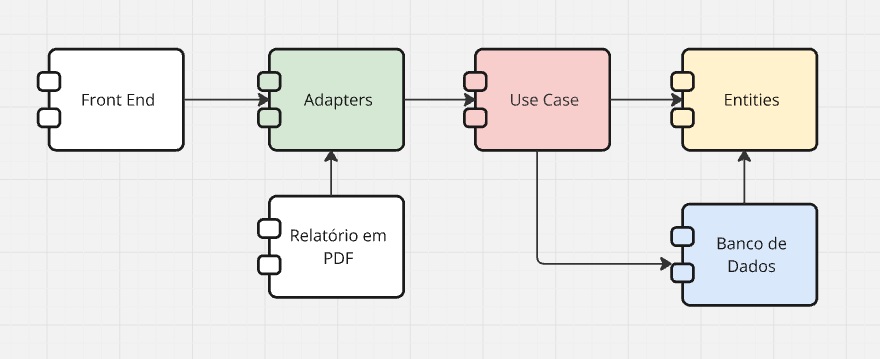
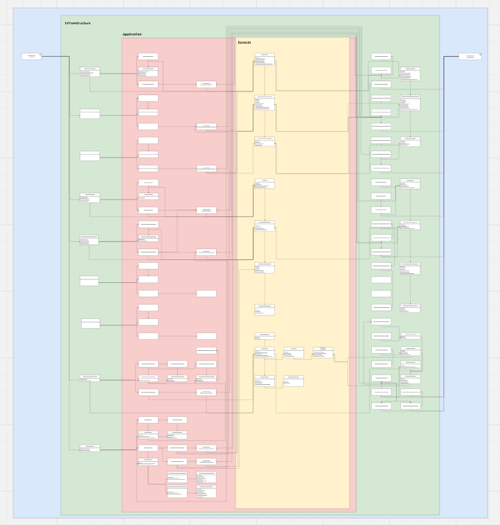

# Boletim Saúde


## 📋 Índice (documentação em construção)

- [Boletim Saúde](#boletim-saúde)
  - [📋 Índice (documentação em construção)](#-índice-documentação-em-construção)
  - [💻 Sobre o Projeto](#-sobre-o-projeto)
  - [⚙️ Funcionalidades](#️-funcionalidades)
    - [Boletim Diário](#boletim-diário)
    - [Relatórios Mensais](#relatórios-mensais)
    - [Edição do Boletim](#edição-do-boletim)
    - [Gerenciamento de Especialidades](#gerenciamento-de-especialidades)
    - [Gerenciamento de Cirurgiões](#gerenciamento-de-cirurgiões)
  - [🛠 Tecnologias](#-tecnologias)
    - [Infraestrutura](#infraestrutura)
    - [Backend](#backend)
    - [Frontend](#frontend)
  - [🏗 Arquitetura](#-arquitetura)
    - [API](#api)
  - [🏗 Design](#-design)
  - [🚀 Como Executar o Projeto](#-como-executar-o-projeto)
    - [Docker](#docker)
      - [1 - Docker Hub:](#1---docker-hub)
      - [2 - Docker com projeto local:](#2---docker-com-projeto-local)
    - [Local (Não finalizado)](#local-não-finalizado)
  - [🧪 Testando o Projeto](#-testando-o-projeto)
  - [🦸 Autor](#-autor)
    - [Lucas Leme](#lucas-leme)

## 💻 Sobre o Projeto

Projeto desenvolvido para a Prefeitura Municipal de Itaberá, com o objetivo de facilitar a criação de relátorios diários e mensais dos atendimentos medicos realizados do município.


## ⚙️ Funcionalidades

### Boletim Diário

- Criação de boletim
- Download do boletim
- Busca de boletins anteriores


### Relatórios Mensais

- Geração de relatórios
- Download de reatórios


### Edição do Boletim

- Edição de linha
  - Adição
  - Exclusão 
  - Alteração da ordem


### Gerenciamento de Especialidades

- Cadastro de especialidade
- Edição de especialidades
- Exclusão de especialidades


### Gerenciamento de Cirurgiões

- Cadastro de cirurgião
- Edição de especialidade
- Exclusão de especialidae


## 🛠 Tecnologias

### Infraestrutura

<table>
  <tr>
    <td style="width: 75px; text-align: center;">
      <a href="https://git-scm.com/downloads">
        
      </a>
      <p style="text-align: center;">Git</p>
    </td>
    <td style="width: 75px; text-align: center;">
      <a href="https://nginx.org/">
        
      </a>
      <p style="text-align: center;">Nginx</p>
    </td>
    <td style="width: 75px; text-align: center;">
      <a href="https://www.docker.com/">
        
      </a>
      <p style="text-align: center;">Docker</p>
    </td>
  </tr>
</table>

### Backend

<table>
  <tr>
    <td style="width: 75px; text-align: center;" >
      <a href="https://www.java.com/pt-BR/">
        
      </a>
      <p style="text-align: center;" width="50" height="50" >Java 21</p>
    </td>
    <td style="width: 75px; text-align: center;">
      <a href="https://maven.apache.org/">
        
      </a>
      <p style="text-align: center;" width="50" height="50" >Maven</p>
    </td>
    <td style="width: 75px; text-align: center;">
      <a href="https://spring.io/projects/spring-boot">
        
      </a>
      <p style="text-align: center;" width="50" height="50" >Spring Boot</p>
    </td>
    <td style="text-align: center;">
      <a href="https://www.postgresql.org/"  >
        
      </a>
      <p style="text-align: center;" width="50" height="50" >PostgreSQL</p>
    </td>
  </tr>
</table>

### Frontend

<table>
  <tr style="width: 75px; text-align: center;">
    <td style="width: 75px;">
      <a href="https://nextjs.org/">
        
      </a>
      <p style="text-align: center;">Next 14</p>
    </td>
    <td style="width: 75px;">
      <a href="https://react.dev/">
        
      </a>
      <p style="text-align: center;">React 18</p>
    </td>
    <td style="width: 75px; margin-left:10px;">
      <a href="https://nodejs.org/pt">
        
      </a>
      <p style="text-align: center;">NodeJS</p>
    </td>
    <td style="width: 75px; margin-left:10px;">
      <a href="https://www.npmjs.com/">
        
      </a>
      <p style="text-align: center;">NPM</p>
    </td>
    <td style="width: 75px; margin-left:10px;">
      <a href="https://tailwindcss.com/">
        
      </a>
      <p style="text-align: center;">TailwindCSS</p>
    </td>
    <td style="width: 75px; margin-left:10px;">
      <a href="https://ui.shadcn.com/">
        
      </a>
      <p style="text-align: center;">shadcn/ui</p>
    </td>
  </tr>
</table>


## 🏗 Arquitetura

### API
A API foi construida usando Clean Architecture baseados no livro de mesmo nome do autor Bob Martin.

<div>
  <div style="display: flex; justify-content: center; align-items: center;">
    
  </div>

  <div style="display: flex; justify-content: center; align-items: center;">
    
  </div>

  <div style="display: flex; justify-content: center; align-items: center;">
    
  </div>
</div>
</br>
Os diagramas da arquitetura foram feitos usando a ferramenta Miro, disponivel em: 

https://miro.com/app/board/uXjVK5NG8zs=/


## 🏗 Design

Design - Figma: https://www.figma.com/design/Ena3r3kvJhocQlGNe5DT7i/Untitled?t=oyZD2n1bGHiyJxZm-0  
Arquitetura - 

## 🚀 Como Executar o Projeto

### Docker

Container - Docker Hub: https://hub.docker.com/repository/docker/lucaslemec/boletim-saude/general  

- Necessário ter o Docker Engine instalado, disponivel em: https://docs.docker.com/engine/install

<br>
Há 2 principais formas de executar a aplicação com o Docker:
<br><br>

#### 1 - Docker Hub:

Forma mais simples, nela será utilizado a ultima versão dos containers disponíveis nos seguintes repositórios: 
Back-end: https://hub.docker.com/repository/docker/lucaslemec/boletim-saude/general
Front-end: https://hub.docker.com/repository/docker/lucaslemec/boletim-saude-app/general

Primeiro é necessário criar um arquivo `docker-compose.yml` com o seguinte conteúdo:
```yaml
#VALORES APENAS DE EXEMPLO, NÃO USAR EM PRODUÇÃO!
name: boletim-saude-infra

services:
  app:
    container_name: boletim-saude-api
    image: lucaslemec/boletim-saude:latest
    environment:
      - POSTGRES_USER=postgres
      - POSTGRES_PASSWORD=postgres
      - POSTGRES_URL=jdbc:postgresql://postgres:5432/BoletimSaude
      - API_TOKEN_SECRET=lzl024rRZc
      - USUARIO_LOGIN=admin
      - SENHA_LOGIN=123
    ports:
      - "8080:8080"
    networks:
      - boletim-saude-network
    depends_on:
      - database

  database:
    container_name: postgres
    image: postgres:16
    environment:
      - POSTGRES_PASSWORD=postgres
      - POSTGRES_USER=postgres
      - POSTGRES_DB=BoletimSaude
    ports:
      - "5432:5432"
    volumes:
      - ../docker/data/postgresql:/var/lib/postgresql/data
    networks:
      - boletim-saude-network

  pgadmin:
    container_name: pgadmin
    image: dpage/pgadmin4
    environment:
      - PGADMIN_DEFAULT_EMAIL=test@test.com
      - PGADMIN_DEFAULT_PASSWORD=123
    ports:
      - "5050:80"
    depends_on:
      - database
    networks:
      - boletim-saude-network

  app-frontend:
    container_name: boletim-saude-app
    image: lucaslemec/boletim-saude-app:latest
    environment:
      - NEXTAUTH_URL=http://localhost:3000
      - NEXTAUTH_SECRET="OFsQ6wuWlBCetNwuME5qus2Zocu23bF0W9d3dZo5hGk="
    ports:
      - "3000:3000"
    networks:
      - boletim-saude-network
    depends_on:
      - app

networks:
  boletim-saude-network:
    driver: bridge
```
Em seguida, abra um terminal na mesma pasta do arquivo e execute o comando:
```bash
docker compose up -d --build
```
Para finalizar a execução, use o comando:
```bash
docker compose down
```

<br>

#### 2 - Docker com projeto local:
Necessário ter o container docker do projeto front-end já baixado, disponível em: https://github.com/LucasLemeCF/Boletim-Saude-Itabera-SP-app

Em seguida é necessário clonar o repositório atual:
```bash
git clone https://github.com/LucasLemeCF/Boletim-Saude-Itabera-SP-api.git
```
Em seguida é necessário criar um arquivo de configuração com as variveis de ambiente chamado .env dentro da raiz do projeto e adicionar o seguinte texto:
```bash
#VALORES APENAS DE EXEMPLO, NÃO USAR EM PRODUÇÃO!

#App
POSTGRES_URL=jdbc:postgresql://postgres:5432/BoletimSaude
API_TOKEN_SECRET=lzl024rRZc
USUARIO_LOGIN=admin
SENHA_LOGIN=123

#Database
POSTGRES_PASSWORD=postgres
POSTGRES_USER=postgres
POSTGRES_DB=BoletimSaude

#PgAdmin
PGADMIN_DEFAULT_EMAIL=test@test.com
PGADMIN_DEFAULT_PASSWORD=123

#Frontend
NEXTAUTH_SECRET="OFsQ6wuWlBCetNwuME5qus2Zocu23bF0W9d3dZo5hGk="
NEXTAUTH_URL=http://localhost:3000
```
Por fim, abra um terminal na mesma pasta do projeto e execute o comando:
```bash
docker compose up -d --build
```
Para finalizar a execução, use o comando:
```bash
docker compose down
```


### Local (Não finalizado)

- Necessário ter o Git instalado, disponivel em: https://git-scm.com/downloads


## 🧪 Testando o Projeto
API Local - Swagger: http://localhost:8080/api/swagger-ui/index.html

## 🦸 Autor
### Lucas Leme

<div>Linkedin: <a href="https://www.linkedin.com/in/lucas-leme/">https://www.linkedin.com/in/lucas-leme/</a></div>
<div>Github: <a href="https://github.com/LucasLemeCF">https://github.com/LucasLemeCF</a></div>